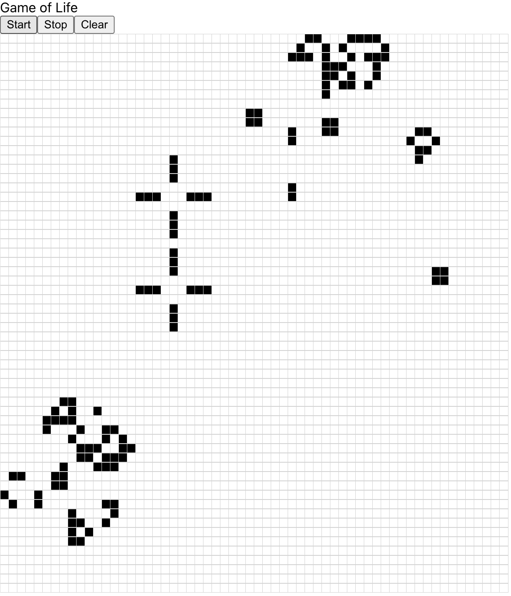

# Game of Life

This is a typescript implementation of **Conway's Game of Life**, see: https://en.wikipedia.org/wiki/Conway%27s_Game_of_Life.

To run the application you need to:

1. Install Node.js (https://nodejs.org/en/)
2. Run `npm i`
3. Run `npm start`

On `http://localhost:3000/` the **Game of Life** will pop up.

## Open Tasks

- Unit test the game logic
- Unit test App component
- Update all packages to latest version

## Features to implement

- As a user, I want to select interesting presets
- As a user, I want to increase the movement speed of the cells
- As a user, I want to have a "better" looking UI
- As a user, I want to select the color of background and cells
- As a user, I want to select the size of the canvas
